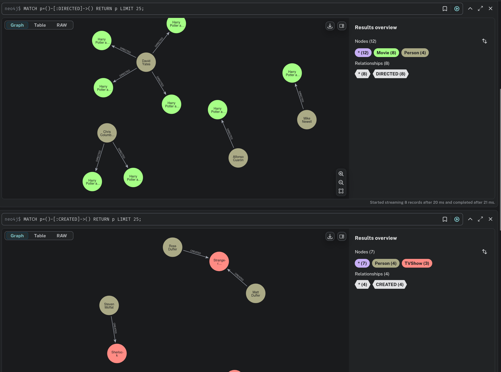
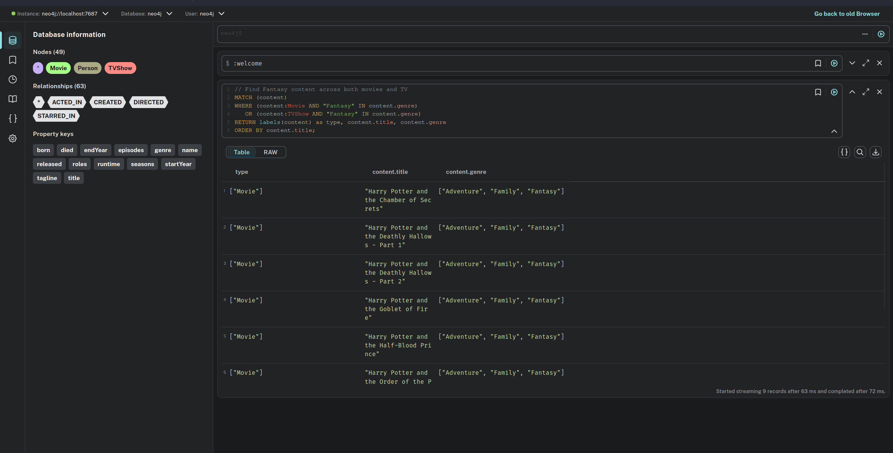

# Neo4j Graph Database setup

<!-- toc -->

- [Neo4j Graph Database setup](#neo4j-graph-database-setup)
  - [Getting started](#getting-started)
  - [Example screenshots](#example-screenshots)
  - [Multi-Dataset Architecture](#multi-dataset-architecture)
    - [Current Structure](#current-structure)
    - [Creating Additional Dataset Instances](#creating-additional-dataset-instances)
    - [Benefits of This Structure](#benefits-of-this-structure)
  - [Access](#access)
  - [Authentication](#authentication)
  - [Accessing the Database](#accessing-the-database)
  - [Manual Re-seeding](#manual-re-seeding)

<!-- tocstop -->

## Getting started

1. docker-compose up
2. visit [http://localhost:7474](<http://localhost:7474>)
3. Query away ;)

## Example screenshots




## Multi-Dataset Architecture

This setup supports multiple independent Neo4j instances in a single compose file, each with their own dataset. Each instance has its own folder under `instances/` containing the seed scripts and data files.

### Current Structure

```text
.
├── data                            # local data is saved here
├── instances                       # instance specific datasets
│   ├── movies-and-tv               # example movie and tv show set
│   │   ├── dataset-info.md         
│   │   └── movie-data.cypher
│   └── _template                   # template folder with example .cypher script
│       └── data-template.cypher
├── compose.yml                     # main compose file, used to start stuff
├── README.md                       # this file
└── seed.sh                         # generic seed script with env vars (shared by all instances)
```

### Creating Additional Dataset Instances

To add a new Neo4j instance for a different dataset (e.g., books, music, sports):

1. **Create instance folder with data only**:

   ```bash
   # Example: Creating a books dataset
   mkdir -p instances/books
   cp instances/movies-and-tv/movie-data.cypher instances/books/books-data.cypher
   # Edit instances/books/books-data.cypher with your books dataset
   ```

2. **Add services to compose.yml**:

   ```yaml
   # Add to the existing compose.yml file
   books-neo4j:
     image: neo4j:5-community
     restart: unless-stopped
     environment:
       # Same as movies-and-tv-neo4j
     volumes:
       - ${APP_DATA}/neo4j/books/data:/data
       - ${APP_DATA}/neo4j/books/logs:/logs
       - ${APP_DATA}/neo4j/books/import:/var/lib/neo4j/import
       - ${APP_DATA}/neo4j/books/plugins:/plugins
     ports:
       - 7475:7474  # Different ports to avoid conflicts
       - 7688:7687

   books-seed:
     image: neo4j:5-community
     depends_on:
       - books-neo4j
     environment:
       NEO4J_PASSWORD: ${NEO4J_PASSWORD}
       INSTANCE_NAME: "books"
       DATASET_NAME: "Books and Authors Database"
       CYPHER_FILE: "/var/lib/neo4j/scripts/books-data.cypher"
     volumes:
       - ./seed.sh:/tmp/seed.sh:ro  # Same template for all!
       - ./instances/books/books-data.cypher:/tmp/books-data.cypher:ro
     command: /bin/bash -c "mkdir -p /var/lib/neo4j/scripts && cp /tmp/books-data.cypher /var/lib/neo4j/scripts/ && bash /tmp/seed.sh"
     restart: "no"
   ```

3. **That's it!** The template seed script automatically configures itself using the environment variables.

This approach keeps everything organized in one place while maintaining clear separation between different datasets.

### Benefits of This Structure

- **Single compose file**: All Neo4j instances managed from one location
- **Organized separation**: Each dataset has its own folder under `instances/`
- **Easy scaling**: Add new instances by creating folders and updating compose.yml
- **Template system**: Use `_template/` files as starting point for new instances
- **Shared configuration**: Common settings (plugins, environment) managed centrally
- **Independent data**: Each instance has its own volumes and data directories

## Access

- **Local**: <http://localhost:7474>
- **Bolt Protocol**: bolt://localhost:7687

## Authentication

- **Username**: `neo4j`
- **Password**: Set via `NEO4J_PASSWORD` environment variable

## Accessing the Database

Since we're using Neo4j Community Edition, all data is in the default database. No database switching required:

```cypher
// Data is immediately available - no database switching needed
MATCH (n) RETURN count(n) as total_nodes;
```

## Manual Re-seeding

To manually clear and re-seed the database:

```cypher
// Clear all data from the default database
MATCH (n) DETACH DELETE n;
```

Then restart the Neo4j stack to trigger re-seeding, or manually run:

```bash
docker-compose exec movies-and-tv-neo4j cypher-shell -u neo4j -p your_password -f /var/lib/neo4j/scripts/movie-data.cypher
```
